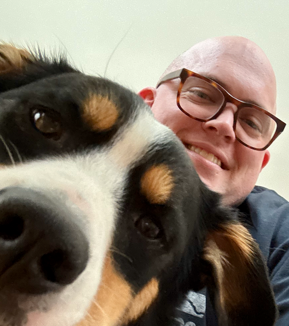

### Thomas Lawton

#### Senior Software Engineer, Moody's

---

Using Python to build developer, productivity, and "personal utility" tools.

Playing rogue-likes, lifting weights, working on keyboards, and catering to my dog.

Working writing and home servers into my day-to-day.

---

[LinkedIn](https://linkedin.com/in/thomas-lawton) -- [Blog](https://rodentia.cc) -- [Resume](https://rodentia.cc/resume)
